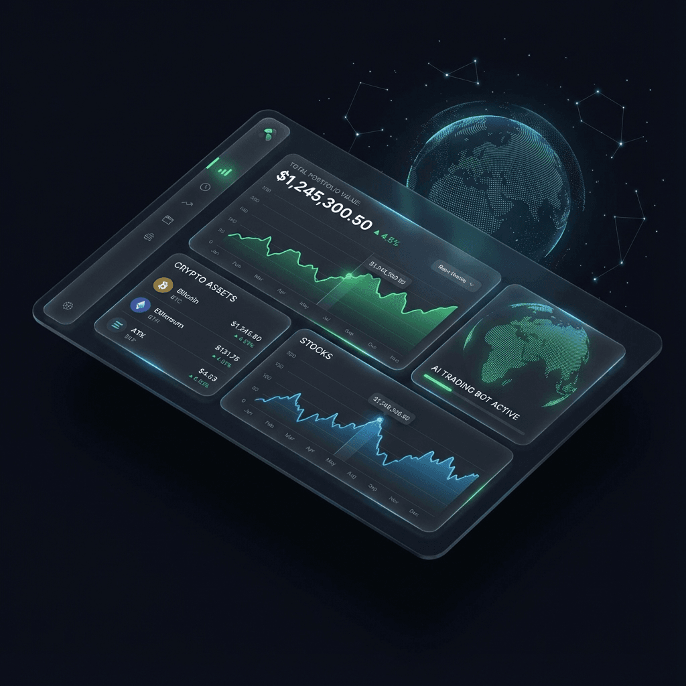

# 
```
  _____  _                  __  __       _        _times_  
 |  __ \| |                |  \/  |     | |      (_)      
 | |  | | |__   __ _ _ __  | \  / | __ _| |_ _ __ ___  __ 
 | |  | | '_ \ / _` | '_ \ | |\/| |/ _` | __| '__| \ \/ / 
 | |__| | | | | (_| | | | || |  | | (_| | |_| |  | |>  <  
 |_____/|_| |_|\__,_|_| |_||_|  |_|\__,_|\__|_|  |_/_/\_\ 
      C A P I T A L   •   W E A L T H   •   F U T U R E
```

<<<<<<< HEAD
> **"The only wealth management platform you'll ever need."**  
> *Institutional-grade strategies. Consumer-grade simplicity.*
=======
**Institutional-Grade Wealth Management for the Modern Investor.**

DhanMatrix Capital is a premium fintech platform designed to provide high-growth investment strategies to Indian investors. Built with a focus on **transparency**, **security**, and **performance**, it offers a seamless, app-like experience on the web.
>>>>>>> 8d37e86e5c1379f2e27682b89981fe200feb7ced

---



## 🌟 The Vision

**DhanMatrix Capital** isn't just another investment app. It's a statement. 
We built this platform to bridge the gap between **complex institutional tools** and **accessible personal finance**. 

Traditional wealth management is clunky, opaque, and outdated. We are:
*   **Transparent**: Real-time tracking, no hidden fees.
*   **Secure**: Bank-grade encryption & SEBI compliance.
*   **Beautiful**: A UI that makes you *want* to check your portfolio.

---

## 💎 Investment Plans: Tailored for Growth

We offer three distinct tiers designed to match your financial ambition.

| Feature | **Silver Plan** 🛡️ | **Gold Plan** ⚡ | **Platinum Plan** 👑 |
| :--- | :--- | :--- | :--- |
| **Investment** | ₹25k - ₹75k | ₹75k - ₹1.25L | ₹1.25L - ₹2.5L |
| **Monthly ROI** | **5%** | **5.7%** | **6.2%** |
| **Risk Profile** | Balanced | Aggressive | High-Yield |
| **Support** | Standard | Priority | Dedicated Manager |
| **Processing** | 24 Hours | 24 Hours | **Instant** |
| **Best For** | Starters | **Most Popular** | HNI / Pros |

---

## 🛠️ Under the Hood: Engineering Excellence

We didn't just build a website; we engineered a **high-performance financial terminal**.

### 🏗️ Architecture
*   **Hybrid Rendering**: We use **Next.js 14 Server Components** for the heavy lifting (Hero, Dashboard Visuals) to ensure instant First Contentful Paint (FCP).
*   **Client Interactivity**: Specific islands of interactivity (`HeroActions.tsx`, `PlansPreview.tsx`) handle user events without bloating the main bundle.

### 🎨 Design System
*   **Typography**: 
    *   *Headings*: `Plus Jakarta Sans` (Modern, geometric, trustworthy).
    *   *Body*: `Inter` (The gold standard for readability).
*   **Palette**: 
    *   `Brand Primary`: `#2563EB` (Trust Blue)
    *   `Brand Accent`: `#0F172A` (Slate Dark)
    *   `Success`: `#10B981` (Emerald Growth)

### 🏎️ Performance Secrets
*   **GPU Acceleration**: Our background blobs use `will-change: transform` to offload animation rendering to the GPU, ensuring a butter-smooth **60fps** experience even on low-end devices.
*   **Dynamic Code Splitting**: Heavy charting libraries (`Recharts`) and animations (`Framer Motion`) are lazily loaded only when they enter the viewport.

---

## 📂 Project Structure

```bash
DhanMatrixCaptital/
├── public/              # Static assets (images, icons)
├── src/
│   ├── app/             # Next.js 14 App Router (Pages & Layouts)
│   │   ├── plans/       # Investment Plans Page
│   │   ├── dashboard/   # User Dashboard (Protected)
│   │   ├── layout.tsx   # Root Layout (Fonts, Providers)
│   │   └── page.tsx     # Homepage (Hero, Features)
│   ├── components/
│   │   ├── home/        # Homepage-specific components (Hero, Mockups)
│   │   ├── ui/          # Reusable UI Kit (Buttons, Cards, Inputs)
│   │   └── providers/   # Context Providers (Auth, Theme)
│   ├── context/         # React Context (Global State)
│   ├── hooks/           # Custom Hooks (useInvestments, useAuth)
│   └── styles/          # Global Tailwind styles
├── tailwind.config.js   # Design System Configuration
└── tsconfig.json        # TypeScript Configuration
```

---

## 🚀 Getting Started

Ready to build the future? Let's get this running on your machine.

### Prerequisites
*   Node.js 18+ (LTS Recommended)
*   A Firebase Project (for Auth & Database)

### Installation

1.  **Clone the Vault**
    ```bash
    git clone https://github.com/codewithyuvraj24/DhanMatrixCapital.git
    cd DhanMatrixCapital
    ```

2.  **Install Dependencies**
    ```bash
    npm install
    ```

3.  **Configure Environment**
    Create a `.env.local` file and add your secret keys:
    ```env
    NEXT_PUBLIC_FIREBASE_API_KEY=your_api_key
    NEXT_PUBLIC_FIREBASE_AUTH_DOMAIN=your_auth_domain
    NEXT_PUBLIC_FIREBASE_PROJECT_ID=your_project_id
    ```

4.  **Launch Development Server**
    ```bash
    npm run dev
    ```
    Visit `http://localhost:3000` and watch the magic happen. ✨

---

## 🔮 Roadmap

*   [x] **Phase 1: Foundation** (Core UI, Auth, Dashboard V1)
*   [x] **Phase 2: Growth** (Investment Plans, Payment Integration)
*   [ ] **Phase 3: Intelligence** (AI-driven Portfolio Recommendations)
*   [ ] **Phase 4: Global** (Multi-currency support, International Markets)

---

## 🤝 Contributing

We believe in open finance. If you have ideas to make this better:
1.  Fork the repo.
2.  Create a feature branch (`git checkout -b feature/amazing-feature`).
3.  Commit your changes.
4.  Open a Pull Request.

---

**Built with 💙 by [CodeWithYuvraj](https://github.com/codewithyuvraj24)**  
*Invest Smart. Grow Faster.*
