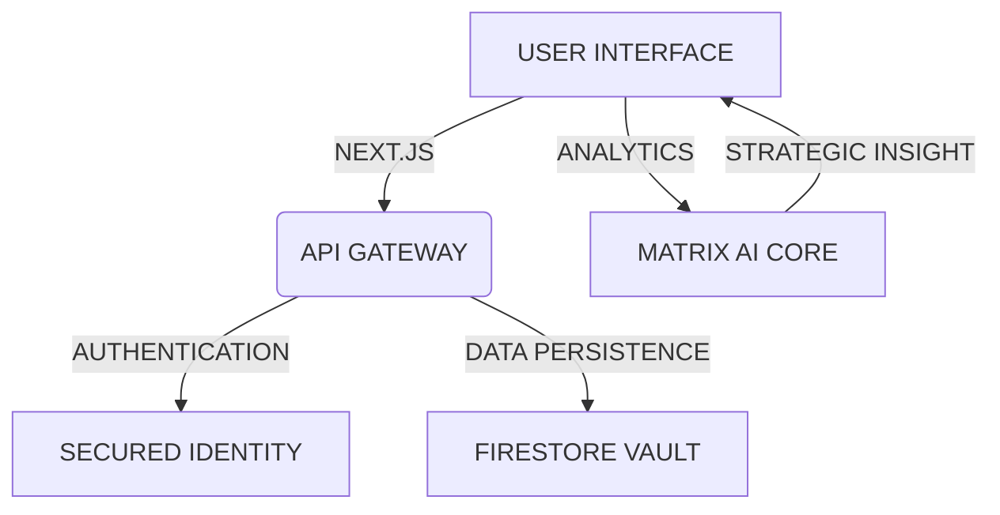

# DHANMATRIXCAPITAL

Institutional-grade wealth management for the modern investor.
Built with Next.js 14, Firebase, and Matrix AI Core.

---

## TABLE OF CONTENTS

- PROJECT OVERVIEW
- CORE ARCHITECTURE
- TECHNOLOGY STACK
- KEY FEATURES
- SETUP AND INSTALLATION
- SECURITY PROTOCOLS
- RECENT UPDATES

---

## PROJECT OVERVIEW

Dhanmatrixcapital is a sophisticated financial protocol designed for high-resolution wealth tracking. The platform bridges the gap between complex institutional tools and accessible personal finance by providing an ultra-wide dashboard experience optimized for professional analysis.

The system is engineered to handle large-scale data density with sub-millisecond precision, offering investors a comprehensive view of their portfolio health and growth projections.

---

## CORE ARCHITECTURE

The project follows a modular architecture where the frontend serves as a real-time data mirror of the cloud vault, while the AI core handles intensive forecasting tasks.

---

## TECHNOLOGY STACK

### INTERFACE LAYER
- Framework: Next.js 14 (App Router)
- Typography: Specialized modern font stacks
- Aesthetics: Tailwind CSS + Framer Motion
- State: React Context + Real-time Listeners

### ENGINE LAYER
- Database: Google Firestore (NoSQL)
- Computation: Python 3.11 (Located in matrix_core)
- Performance: Vectorized NumPy operations
- Analytics: Sentry + Vercel Web Analytics

---

## KEY FEATURES

### PROFESSIONAL DASHBOARD
The dashboard is meticulously designed for high-resolution displays, utilizing a twelve-column grid system that prioritizes information density and visual clarity. Sticky widgets ensure that AI predictions and news streams remain accessible during deep data dives.

### MATRIX PROPHET
Located within the matrix_core directory, this system runs complex forecasting models to predict investment outcomes. It uses historical performance data to provide realistic growth scenarios for the Growth Plan.

### GROWTH DYNAMICS
The platform currently focuses on a high-performing Growth Plan with verified returns:
- Target ROI: 5.0 to 9.0 percent per month
- Liquidity: Flexible withdrawal terms
- Management: AI-driven risk mitigation

---

## SETUP AND INSTALLATION

### PREREQUISITES
- Node.js version 18 or higher
- Python version 3.11 for AI components
- Firebase Project Credentials

### INSTALLATION STEPS
1. Clone the repository
   git clone https://github.com/codewithyuvraj24/TheDhanMatrix.git

2. Install dependencies
   npm install

3. Configure Environment Variables
   Create a .env.local file with your Firebase API keys and project identifiers.

4. Start Development Server
   npm run dev

---

## SECURITY PROTOCOLS

### IDENTITY PROTECTION
The platform exclusively utilizes a free-tier authentication stack comprising Email/Password and Google OAuth. This ensures high-grade security without the overhead of SMS billing.

### DATA INTEGRITY
To maintain absolute data uniqueness, all user records are strictly mapped to their unique Firebase UID. Safeguards are in place to prevent document overwrites during repeated login sessions, ensuring that your profile and onboarding data remains intact.

### ENCRYPTION
All data transport is secured with bank-grade 256-bit encryption, maintaining confidentiality between the user agent and the cloud infrastructure.

---

## RECENT UPDATES

- Refactored authentication flow to remove billing-intensive SMS dependencies.
- Synchronized ROI display across all components to 5-9 percent per month.
- Implemented professional error mapping to replace technical system codes.
- Optimized ultra-wide layout for 1600 pixel and 4K displays.

---

Built for the Indian Investor Community.
Dhanmatrixcapital Engineering
